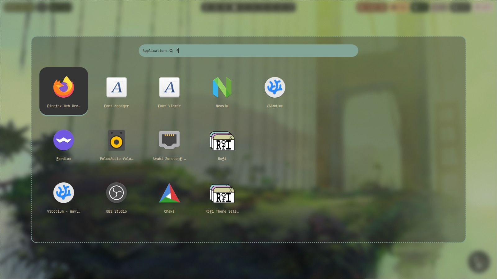
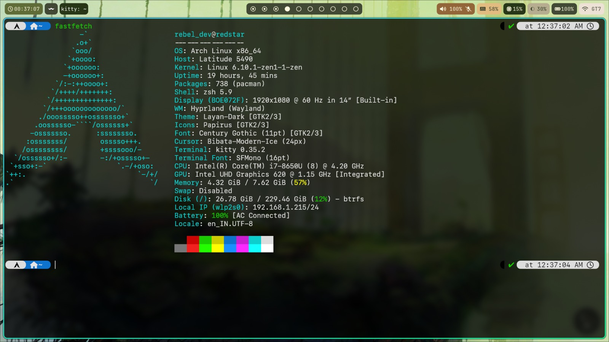

# Redstar Dotfiles

This repository contains all the dotfiles for my Arch Linux setup. I am using Hyprland as my window manager and I have a custom rice for it.

## Description

- **Window Manager**: Hyprland
- **Terminal**: Kitty
- **Shell**: Zsh
- **Editor**: Neovim
- **Application Launcher**: Rofi (Configuration Based on [adi1090x](https://github.com/adi1090x/rofi))
- **Browser**: Firefox
- **File Manager**: Superfile
- **Screenshot Tool**: Hyprshot
- **Wallpapers**: [Alpha Coders](https://wallhaven.cc/w/3q8z2ohttps://alphacoders.com/post-apocalyptic-4k-wallpapers)

## Installation

1. Clone the repository
2. Run the `install.sh` script
3. Restart your system

## Screenshots

